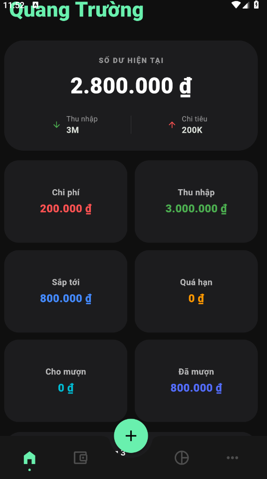
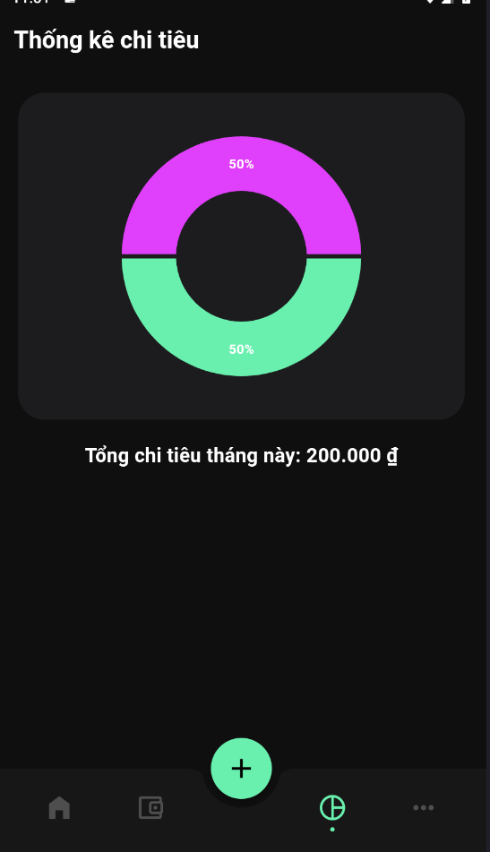
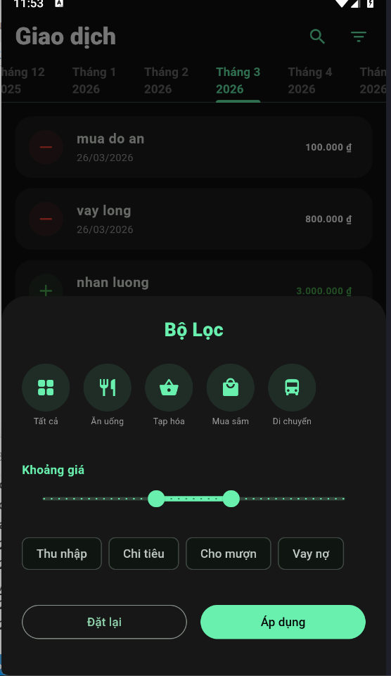

# 💰 SFINANCE - Giải pháp Quản lý Tài chính Cá nhân Toàn diện

**SFINANCE** là một ứng dụng di động mạnh mẽ được xây dựng trên nền tảng **Flutter**, thiết kế riêng để giúp người dùng kiểm soát dòng tiền, quản lý vay nợ và phân tích thói quen tiêu dùng thông qua dữ liệu trực quan.

---

## 📸 Demo Giao diện
*(Sau khi đẩy code lên, Trường hãy chụp ảnh app và lưu vào thư mục `screenshots/` rồi thay link vào đây)*
| Dashboard 6 Chỉ số | Phân tích Biểu đồ | Bộ lọc Nâng cao |
| :---: | :---: | :---: |
|  |  |  |

---

## 🧠 Logic Tính toán & Hệ thống Phân tích (Core Analytics)

Là một dự án hướng tới sự chính xác của dữ liệu, SFINANCE tập trung vào các thuật toán xử lý logic tại lớp `Provider`:

### 1. Thuật toán Dashboard 6 Chỉ số
Hệ thống sử dụng các hàm xử lý mảng nâng cao (`fold`, `where`) để tính toán thời gian thực:
* **Số dư khả dụng:** Được tính bằng công thức `Tổng Thu - Tổng Chi`.
* **Quản lý Vay & Nợ:** Tự động lọc các giao dịch có `isCompleted == 0` (Chưa hoàn thành) để nhắc nhở người dùng về các khoản tiền đang bị chiếm dụng hoặc cần chi trả.
* **Cảnh báo Quá hạn (Overdue):** Logic so sánh `dueDate` (Hạn định) với thời gian thực của hệ thống để đưa ra cảnh báo về các khoản nợ chậm trễ.

### 2. Phân tích Tỷ trọng Chi tiêu (Pie Chart Logic)
* **Aggregation (Gom nhóm):** Sử dụng `groupBy` để nhóm hàng trăm giao dịch thô vào các danh mục lớn (Ăn uống, Mua sắm, v.v.).
* **Weight Calculation:** Tính toán tỷ lệ phần trăm đóng đóng góp của từng hạng mục vào tổng chi tiêu tháng để vẽ biểu đồ tròn trực quan qua thư viện `fl_chart`.

### 3. Bộ lọc Đa tầng (Multi-layered Filtering)
Hệ thống tìm kiếm tích hợp logic lọc "chồng" nhau:
* Lọc theo **Từ khóa** (Search term) trong Tiêu đề và Ghi chú.
* Lọc theo **Khoảng giá** (Range Slider) từ thấp đến cao.
* Lọc theo **Trạng thái & Loại** giao dịch.

---

## 🛠 Công nghệ & Thư viện sử dụng

* **Framework:** Flutter (Dart)
* **Quản lý trạng thái:** Provider (Clean Architecture)
* **Cơ sở dữ liệu:** SQLite (sqflite) - Đảm bảo dữ liệu lưu trữ cục bộ, bảo mật và truy xuất nhanh.
* **Thư viện hỗ trợ:** * `fl_chart`: Xử lý biểu đồ phân tích.
    * `intl`: Định dạng tiền tệ VNĐ và thời gian chuẩn hóa.
    * `collection`: Xử lý logic nhóm dữ liệu phức tạp.

---

## 📥 Hướng dẫn Cài đặt & Khởi chạy

Để chạy dự án này trên môi trường phát triển của bạn, hãy đảm bảo đã cài đặt **Flutter SDK** và thực hiện các bước sau:

### 1. Yêu cầu hệ thống
* Flutter: 3.x trở lên.
* Dart: 3.x trở lên.
* Android Studio hoặc VS Code (đã cài plugin Flutter).

### 2. Các bước thực hiện
```bash
# Bước 1: Clone dự án từ GitHub
git clone [https://github.com/2bllikigai/sfinance.git](https://github.com/2bllikigai/sfinance.git)

# Bước 2: Di chuyển vào thư mục dự án
cd sfinance

# Bước 3: Tải các thư viện phụ thuộc
flutter pub get

# Bước 4: Chạy ứng dụng (Đảm bảo đã mở máy ảo hoặc kết nối thiết bị thật)
flutter run
```
 ## 📂 Cấu trúc Thư mục Dự án
 Dự án được tổ chức theo kiến trúc Clean Code, tách biệt giữa giao diện và logic xử lý dữ liệu:

```text
sfinance/
├── android/                # Cấu hình nền tảng Android (Gradle, Manifest)
├── assets/                 # Chứa hình ảnh, icons và font chữ (BeVietnamPro)
├── lib/                    # Thư mục chứa mã nguồn chính (Dart)
│   ├── data/               # Quản lý Database (SQLite Helper)
│   ├── models/             # Định nghĩa cấu trúc dữ liệu (TransactionModel)
│   ├── providers/          # Bộ não của app (Xử lý Logic & State Management)
│   ├── screens/            # Giao diện các màn hình (Home, List, Statistics, Pin)
│   ├── widgets/            # Các thành phần giao diện dùng chung (Custom Card, Button)
│   └── main.dart           # Điểm khởi đầu (Entry point) của ứng dụng
├── .gitignore              # Chặn các file rác (build/, .gradle/) khi push lên GitHub
└── pubspec.yaml            # Quản lý thư viện (fl_chart, provider, sqflite)
```
## 👨‍💻 Thông tin Tác giả
* Họ và tên: Kiều Quang Trường
* Ngày sinh: 08/11/2005
* Học vấn: Sinh viên năm 3, Khoa Công nghệ Thông tin - Đại học Đại Nam (DNU).
* Niên khóa: 2023 - 2027.
* Định hướng sự nghiệp: Theo đuổi lộ trình trở thành Data Analyst chuyên sâu trong lĩnh vực Logistics.
* Kỹ năng dự án: Flutter, Dart, SQLite, SQL, Data Visualization.